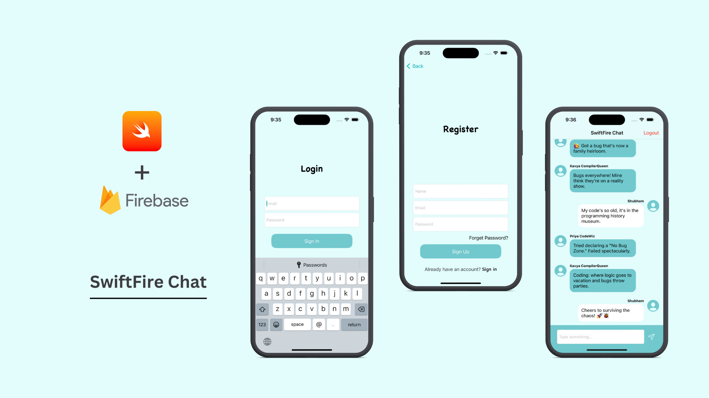

# SwiftFire Chat



An iOS chat application built using Xcode with Firebase integration using Swift Package Manager. The app allows users to send and receive real-time messages.

## Features

- User authentication using Firebase Authentication.
- Real-time chat functionality with Firebase Firestore.
- Dark mode

## Prerequisites

Before you begin, ensure you have the following:

- Xcode installed on your development machine.
- A Firebase project created on the Firebase console.
- Firebase dependencies added to your Xcode project using Swift Package Manager.

## Getting Started

1. Clone the repository:

   ```bash
   git clone https://github.com/itz-shubham/SwiftFire-Chat.git
   ```

2. Open the Xcode workspace (`YourChatApp.xcodeproj`) and build the project.

3. Run the app on a simulator or a physical device.

## Configuration

Ensure that you have updated the Firebase configuration in your Xcode project with the appropriate credentials. Refer to [Firebase Documentation](https://firebase.google.com/docs/ios/setup) for more details.

## Swift Package Manager

This project uses Swift Package Manager for Firebase dependencies. Make sure to have the necessary packages installed:

```bash
# Navigate to the project directory
cd /path/of/project

# Fetch and resolve Firebase dependencies
swift package resolve
```

## Contributing

1. Fork the repository.
2. Create a new branch for your feature: `git checkout -b feature-name`.
3. Commit your changes: `git commit -m 'Add some feature'`.
4. Push to the branch: `git push origin feature-name`.
5. Submit a pull request.

## Issues

If you encounter any issues or have questions, please open an issue on the [Issues](https://github.com/itz-shubham/SwiftFire-Chat/issues) page.

## License

This project is licensed under the [MIT License](LICENSE).

